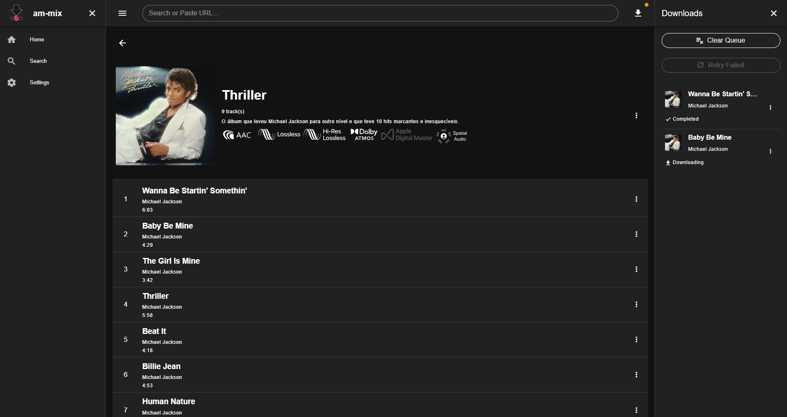

# am-mix

Desktop app for downloading media from [Apple Music](https://music.apple.com).

Powered by [gamdl](https://github.com/glomatico/gamdl) on the backend and built with [Vue](https://vuejs.org/) + [Pyloid](https://github.com/pyloid/docs).

**Discord:** <https://discord.gg/aBjMEZ9tnq>

> [!WARNING]
> **Early development** - features and behavior may change; some flows are still experimental. Use at your own risk.

## ✨ Features

- 🔍 **Search & URLs** - Search Apple Music or paste song, music video, uploaded video, album, and playlist links.
- 📥 **Download Queue** - Concurrent downloads with retry and cancel.
- 🎵 **Songs & Lyrics** - Download songs in various formats with synced lyrics.
- 🎬 **Music Videos & Posts** - Music videos up to 4K and artist uploaded videos.
- 🎤 **Artist Pages** - Browse catalogs and queue an entire tab at once.

## 📋 Prerequisites

### Required

- **Active Apple Music subscription**
- **Apple Music authentication** (configure one method in [Settings](#settings) on first launch):
  - **Cookies** - export your browser cookies in Netscape format while logged in at [Apple Music](https://music.apple.com):
    - **Firefox**: [Export Cookies](https://addons.mozilla.org/addon/export-cookies-txt)
    - **Chromium**: [Get cookies.txt LOCALLY](https://chromewebstore.google.com/detail/get-cookiestxt-locally/cclelndahbckbenkjhflpdbgdldlbecc)
  - **Media user token** - paste your token from the browser (advanced)
  - **Wrapper** - use a [wrapper](https://github.com/WorldObservationLog/wrapper) server instead of cookies (required for some experimental song codecs; see [gamdl's wrapper docs](https://github.com/glomatico/gamdl#wrapper))

### Dependencies

Add these tools to your system **PATH**, or set their paths in [Settings](#settings) (`~/.am-mix/config.yml`). Which tools you need depends on which features you use:

| Use Case                      | Settings                                                                                                                                                              | Required Tools                                                        |
| ----------------------------- | --------------------------------------------------------------------------------------------------------------------------------------------------------------------- | --------------------------------------------------------------------- |
| **Songs (legacy codecs)**     | Song Codec Priority: `aac-legacy` or `aac-he-legacy`                                                                                                               | None                                                                  |
| **Songs (non-legacy codecs)** | Song Codec Priority: `aac`, `aac-he`, `aac-binaural`, `aac-downmix` `aac-he-binaural`, `aac-he-downmix`, `atmos`, `ac3`, `alac`, `ask` API Method: `wrapper` | [Wrapper](https://github.com/WorldObservationLog/wrapper)             |
| **Music videos**              | Music Video Remux Mode: `ffmpeg` Music Video Remux Mode: `mp4box`                                                                                                  | FFmpeg, mp4decrypt MP4Box, mp4decrypt                              |
| **Faster downloads**          | Download Mode: `nm3u8dlre`                                                                                                                                            | [N_m3u8DL-RE](https://github.com/nilaoda/N_m3u8DL-RE/releases/latest) |

#### Tool reference

| Tool            | Download                                                                                                              | Purpose                                   |
| --------------- | --------------------------------------------------------------------------------------------------------------------- | ----------------------------------------- |
| **FFmpeg**      | [Windows](https://github.com/AnimMouse/ffmpeg-stable-autobuild/releases) · [Linux](https://johnvansickle.com/ffmpeg/) | Music video remuxing                      |
| **MP4Box**      | [Download](https://gpac.io/downloads/gpac-nightly-builds/)                                                            | Music video remuxing                      |
| **mp4decrypt**  | [Download](https://www.bento4.com/downloads/)                                                                         | Music video decryption                    |
| **N_m3u8DL-RE** | [Download](https://github.com/nilaoda/N_m3u8DL-RE/releases/latest)                                                    | Optional faster HLS downloads             |
| **Wrapper**     | [Download](https://github.com/WorldObservationLog/wrapper)                                                            | Non Legacy Song Codecs without API limits |

## 📦 Installation

1. Download the latest release from [GitHub](https://github.com/glomatico/am-mix/releases/latest).
2. Extract the zip file.
3. Run the `am-mix` executable.

## ⚙️ Settings

Configure your settings in the Settings page or using the config file (`~/.am-mix/config.yml`).

## 📄 License

MIT License - see the [LICENSE](LICENSE) file for details.
